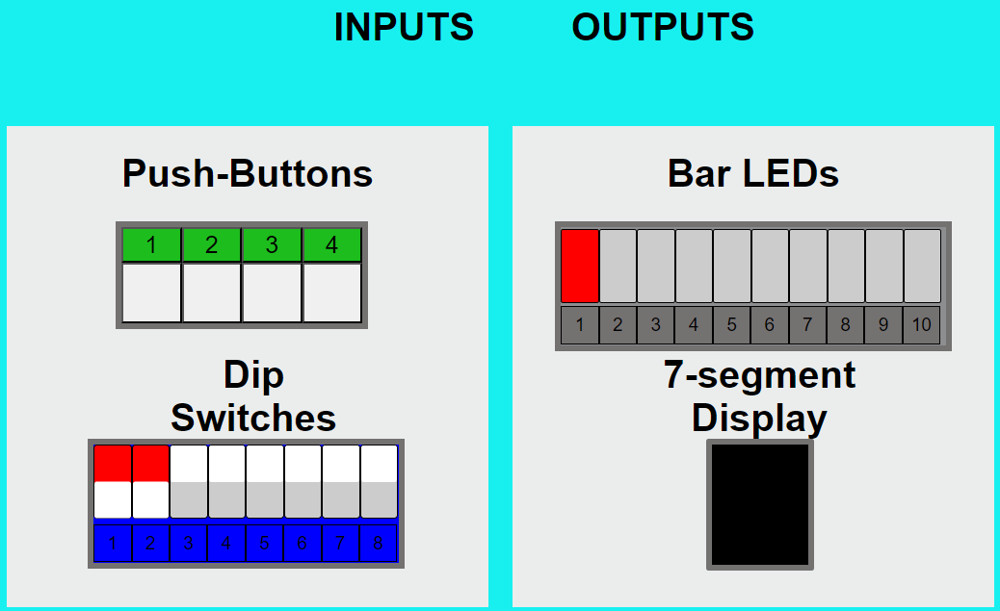

# GIỚI THIỆU

Giáo dục kỹ thuật thiết kế vi mạch chủ yếu dựa vào các công việc trong phòng thí nghiệm để thực thi hiệu quả việc học các nguyên tắc thiết kế vi mạch. Ngày nay các trường đại học đang phải đối mặt với chi phí mua sắm tốn kém cho thiết bị phòng thí nghiệm thiết kế vi mạch. Bài báo này giới thiệu một phòng thí nghiệm FPGA ảo phục vụ đào tạo kỹ thuật thiết kế vi mạch. Ứng dụng phòng thí nghiệm dựa trên web mô phỏng một bo mạch FPGA với các tiện ích và chức năng tương tự được sử dụng trong các phòng thí nghiệm kỹ thuật thiết kế vi mạch. Đầu tiên, người dùng tạo các tệp kết nối thiết kế Verilog và thiết kế FPGA bằng trình chỉnh sửa. Thứ hai, người dùng kiểm tra cú pháp của thiết kế và các tệp kết nối. Thứ ba, người dùng kích hoạt đầu vào của thiết kế theo khả năng kết nối trong tệp kết nối thông qua các công tắc và nút ấn của GUI FPGA mô phỏng (tức là ứng dụng phòng thí nghiệm FPGA ảo). Cuối cùng, người dùng giám sát kết quả đầu ra của thiết kế trên đèn LED của GUI FPGA mô phỏng. Nguyên mẫu này được lập trình bằng JavaScript và có thể mô phỏng các thiết kế phòng thí nghiệm điển hình của trường đại học như cổng AND, mux, bộ mã hóa, bộ giải mã, flipflop, bộ đếm, FSM, v.v. Ứng dụng này sẽ cho phép đào tạo kỹ thuật thiết kế vi mạch không cần phòng thí nghiệm và học tập miễn phí thiết kế vi mạch cho bất cứ ai ở bất cứ đâu và bất cứ lúc nào. Các nhu cầu, yêu cầu, kiến ​​trúc, cách triển khai và cách sử dụng của phòng thí nghiệm FPGA ảo đề xuất đều được nghiên cứu và chứng minh. Ứng dụng này là nguồn mở trên GitHub. Từ khóa—FPGA, Thiết kế vi mạch, Verilog, phòng thí nghiệm ảo.

Phòng thí nghiệm FPGA ảo phục vụ đào tạo và giáo dục kỹ thuật thiết kế vi mạch. Ứng dụng dựa trên web sử dụng công nghệ Internet để mô phỏng các bo mạch FPGA để thiết kế, xác minh và thử nghiệm vi mạch.  Lợi ích là tăng năng suất học tập và giảm chi phí đào tạo kỹ thuật thiết kế vi mạch.

#### Chi tiết về thí nghiệm:
* ##### Phòng thí nghiệm ảo sẽ được khởi tạo khi user đã hoàn thành các bước sau:
1. User đã nhập code hoàn chỉnh từ file Verilog theo các bài như BAI2A, BAI3A,...
2. Nhấn Run trên màn hình 
3. Khung Console hiển thị dòng "Compile successfully module BAI1"
=> User đã có thể thực hiện quá trình mô phỏng trực tiếp ở phần mô phỏng phía dưới.
* ##### Lưu ý: 
-Phần mô phỏng sẽ không được kích hoạt khi có vấn đề về code, vì vậy phần input và output sẽ kh thể thực hiện.

#### Phần đã thực hiện:
-Nhận inputs từ user và xuất outputs sau khi đã xử lý đoạn mã. Outputs sẽ hiển thị thông qua phần giao diện mô phỏng. Inputs là đoạn mã từ Verilog mà user đã nhập. 
